# Project Sentinel

Mission control for long Claude Code runs: context, run progress and the prompt cache at a
glance, Autopilot handoffs before the context fills up, guardrails, and a calm view of what Claude
did. For the terminal CLI and for local sessions in Claude Desktop's Code tab.

Project Sentinel was called **Control Room** until 1.4.0; its panel still is, and `/cr` still
opens it. An existing install moves over by itself (see [Coming from Control Room](#coming-from-control-room)).

[](https://github.com/Arjun0014/project-sentinel/actions/workflows/check.yml)
[](LICENSE)


<p align="center">
  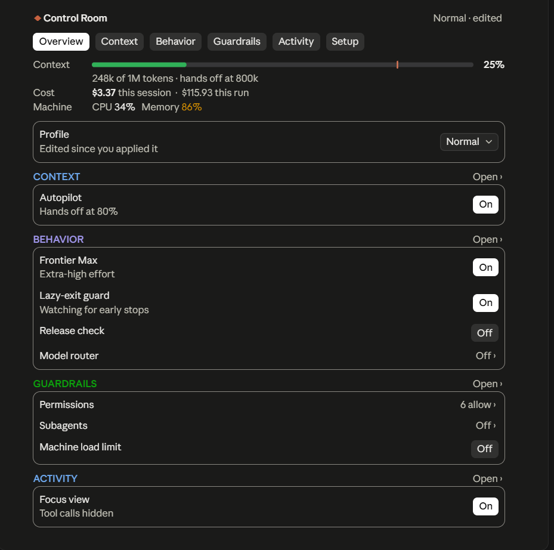
</p>

One plugin gives you:

- a calm **status bar** above the prompt, a mission HUD: what the run is doing or waiting for,
  in words, and only what needs a look; below it the run's instruments (work, context, the prompt
  cache, cost), each its own shape
- the **Control Room** panel, docked beside the conversation
- **Autopilot** (Context Autopilot): Claude writes handoff notes, the context is cleared, and Claude
  carries on in a fresh one, before this one fills up; then Project Sentinel checks what the handoff
  left and what the fresh context picked up
- **Cache Guardian**: the prompt cache in view, why each rebuild happened and how to avoid the
  next, model switches confirmed before they throw a large cache away, and *Keep warm*, which
  holds the cache while you are away
- **run progress** that survives those handoffs, and an **Activity** view that leads with what
  needs a look
- **answer styles**: brief, Simplified Technical English, mission-control status calls, or a quest
  log with XP for verified progress
- policies for effort, finishing the job, models, subagents, machine load and risky actions, with
  **profiles** that set everything at once
- **Kit**, if you like: a small Claude-orange creature above the status bar that shows what Claude
  is doing, and answers a click

> **Status: 1.4.2.** Project Sentinel is built on Claude Code's function-hooks plugin API ("mods"),
> which is still early access and may change between Claude Code releases. It is verified on
> Claude Code **2.1.289**, **2.1.292** and **2.1.293** (the engine the CLI and Claude Desktop run
> now) on Windows 11. See [Compatibility](#compatibility).

<p align="center">
  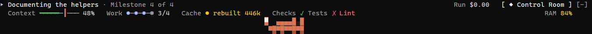
</p>

---

## Contents

- [Screenshots](#screenshots)
- [Features](#features)
- [Requirements](#requirements)
- [Install](#install)
- [Using Project Sentinel](#using-project-sentinel)
- [Profiles](#profiles)
- [How the systems interact](#how-the-systems-interact)
- [Security and privacy](#security-and-privacy)
- [Compatibility](#compatibility)
- [Limitations](#limitations)
- [Development](#development)
- [License](#license)

Further reading: [Configuration](docs/CONFIGURATION.md) ·
[Troubleshooting](docs/TROUBLESHOOTING.md) · [Design](docs/DESIGN.md) ·
[Architecture](docs/ARCHITECTURE.md) · [Security](SECURITY.md) · [Changelog](CHANGELOG.md) ·
[Contributing](CONTRIBUTING.md)

## Screenshots

### In the terminal

<table>
  <tr>
    <td width="50%">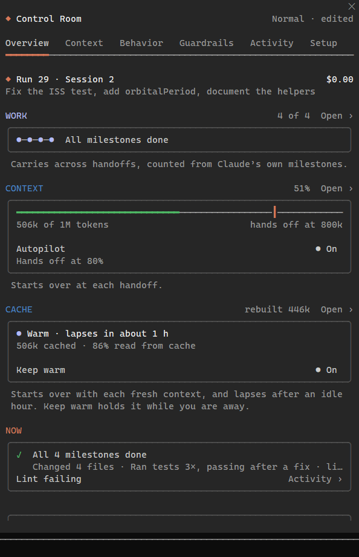</td>
    <td width="50%">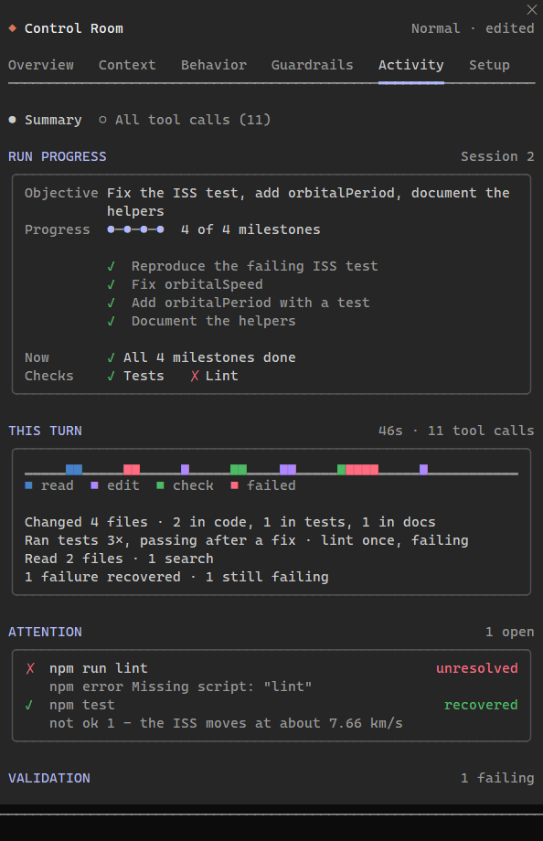</td>
  </tr>
  <tr>
    <td>Overview: the run, then its three lifecycles (work, context and the prompt cache), each with how it starts over.</td>
    <td>Activity leads with the run: its milestones, where the turn's time went, and what needs a look, with the line of output that says why.</td>
  </tr>
  <tr>
    <td width="50%">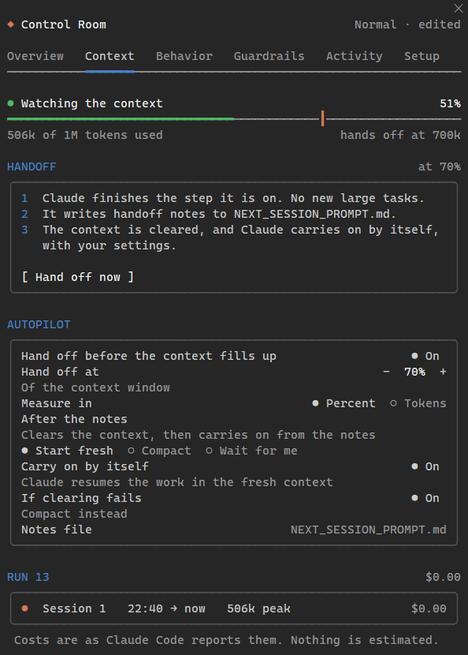</td>
    <td width="50%">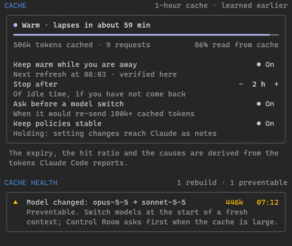</td>
  </tr>
  <tr>
    <td>Context: when Claude hands off, and what happens when it does.</td>
    <td>Further down Context, the prompt cache: what it holds and for how long, Keep warm, and each rebuild with what would have avoided it.</td>
  </tr>
  <tr>
    <td width="50%">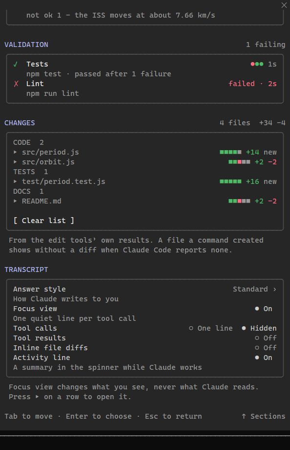</td>
    <td width="50%">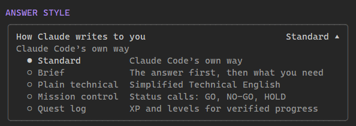<br>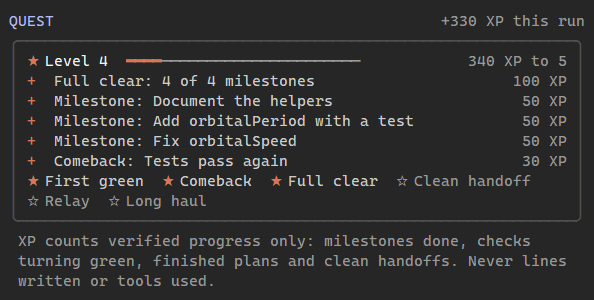</td>
  </tr>
  <tr>
    <td>Further down Activity: each check's runs as dots, and every changed file by kind with its diffstat, each opening its diff in place.</td>
    <td>Answer styles: how Claude writes to you, each with a line on what it means. The Quest log: XP only for progress Project Sentinel can count, never for lines or tool calls.</td>
  </tr>
</table>

<p align="center">
  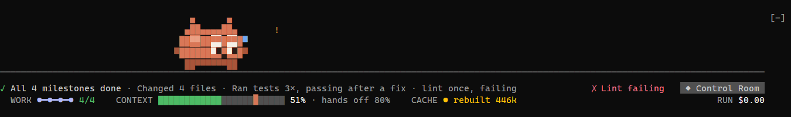
</p>

<sub>Control Room 1.3.0 in a 150-column Windows console (Claude Code 2.1.293), with the panel
docked beside the conversation (the Answer style and Quest cards are from 1.1.0; they did not
change). The work is a scripted turn played by the development-only
[demo driver](tools/demo/README.md): Claude Code ran every tool call in it for real (a test that
fails and is fixed, new code with its test, a lint script that does not exist), but no model wrote
the words, and the token counts are scripted, a model switch halfway through included. Claude
Code reports no cost for them, so the cost reads $0.00 (with a `+` after a cleared session whose
cost was not reported).</sub>

### In Claude Desktop

<table>
  <tr>
    <td width="33%">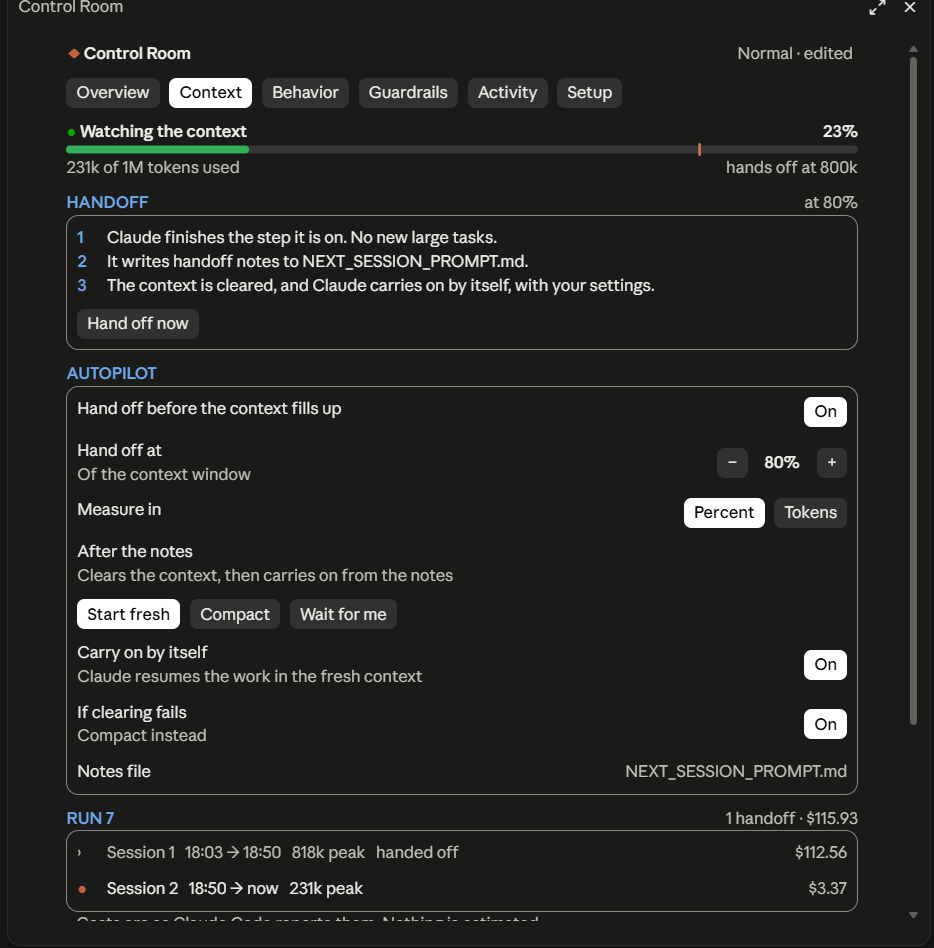</td>
    <td width="33%">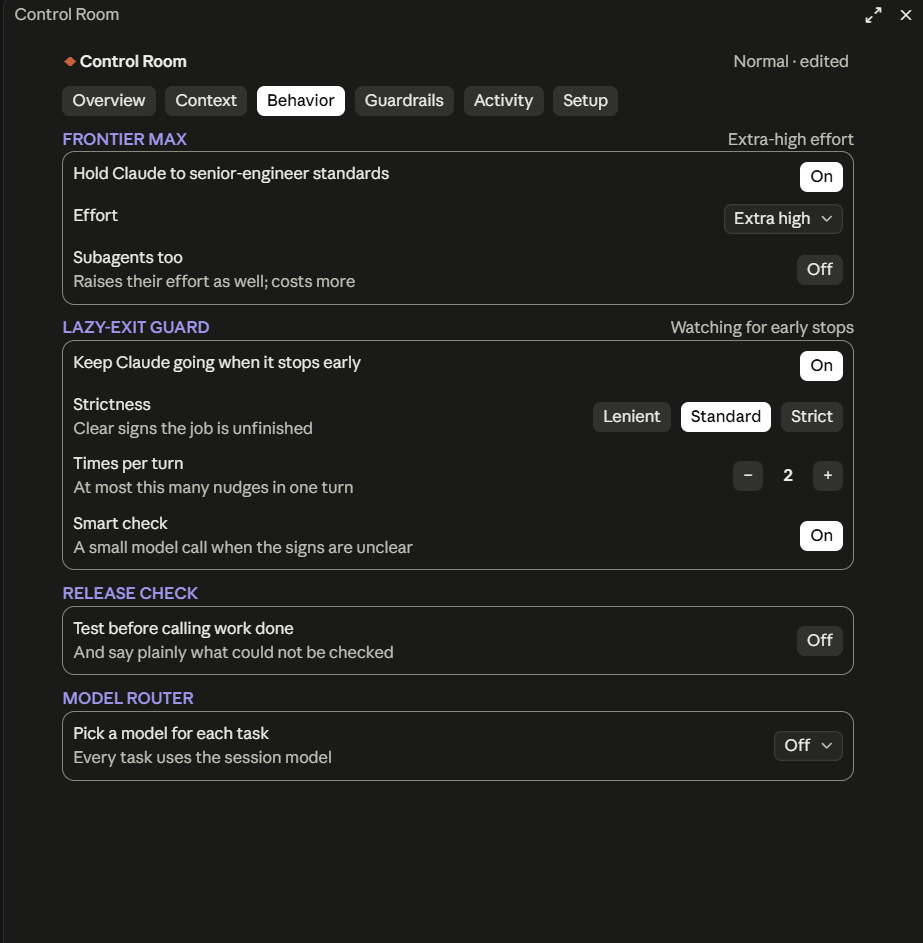</td>
    <td width="33%">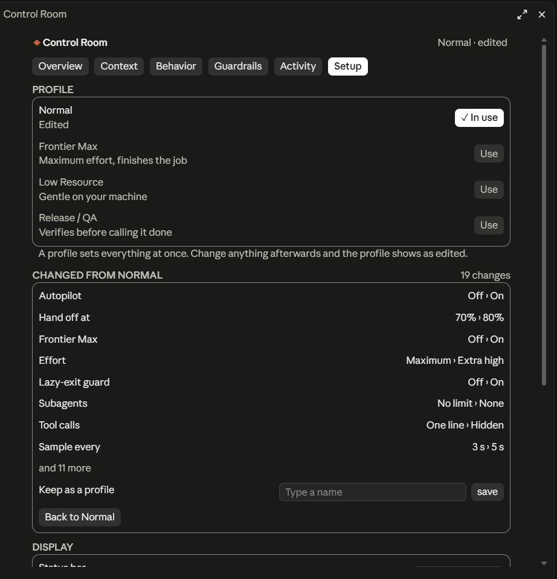</td>
  </tr>
  <tr>
    <td>Context, mid-run: one handoff behind it, $115.93 so far.</td>
    <td>Behavior: each system on its own card.</td>
    <td>Setup: exactly what changed since the profile.</td>
  </tr>
</table>

<sub>Control Room 1.0.1 in Claude Desktop's Code tab, from real sessions. On Desktop the controls
are native buttons and popups and the meters are drawn as graphics. What came after (the
two-line status bar, Activity's charts, the answer styles, the Cache card and Kit) has not been
photographed on Desktop yet.</sub>

## Features

| System | What it does | Default |
| --- | --- | --- |
| **Status bar** | A mission HUD above the prompt. The headline says what the run is doing in words, with a mark for its state: working, thinking, running a check, waiting for you, waiting for a result that comes by itself (a background job, a scheduled wake-up), blocked, handing off, done. On its right, only what needs a look (a failing check, issues, a busy machine, agents), then the Control Room button. Below, the instruments, each its own shape: Work (a track of milestones), Context (a bar with Autopilot's handoff notch), Cache (a clock face, only while it matters) and the run's cost. A handoff that needs you takes a line of its own above, with its buttons. On Desktop the four readings sit in a grid of equal cells and always keep their places. | On |
| **Control Room panel** | Six sections: Overview, Context, Behavior, Guardrails, Activity, Setup. In the terminal: switches, segmented choices, choices that open in place, and − / + steppers. Every control works with a click or with Tab and Enter, and there are no popups to get stuck in. On Desktop: native buttons and popups, plus graphical meters. | `/cr` opens it |
| **Autopilot** (Context Autopilot) | At a threshold (a % of the window, or tokens), Claude finishes the step it is on. Then it runs a handoff: it records the run's milestones, updates the project's docs, keeps CLAUDE.md for durable instructions only, runs a minimal validation and writes `NEXT_SESSION_PROMPT.md` in its own words. Project Sentinel then runs `/clear`, seeds the fresh context with the run's milestones and objective, and Claude continues on its own. Every step moves on when its turn starts or ends, never on a timer. A fresh context that starts close to the threshold gets room to work before it may hand off again. Compaction is only a fallback for when clearing is refused. A reload of the plugin mid-handoff carries the handoff on; it never starts a second one. | Off |
| **Handoff Health and Continuity** | After each handoff, Context → *Last handoff* shows what it left for the fresh context (run state saved, the milestone under way, the notes, docs updated, validation recorded) and, once the fresh context's first turn ends, what it picked up (notes read, run state restored, milestone picked up, docs read, work resumed). Counted from tool calls, never from what Claude says. | With Autopilot |
| **Run progress** | The run's objective and milestones, done of total, counted from Claude's own task list and carried across handoffs, so the work meter keeps climbing while the context meter starts over. A milestone may also be *verifying* (with its evidence) or *blocked* (with what it waits for). Where Claude Code offers no task list (its task tools are off by default in 2.1.29x), Project Sentinel gives Claude a small `milestones` tool to keep one. | On |
| **Cache Guardian** | The main conversation's prompt cache, from the token counts Claude Code reports for each request: how much is cached, how long it stays warm (the cache's lifetime is learned), the share read from the cache, and why each rebuild happened (a model or effort switch, the model router, changed policies, a new tool, compaction, idling past the lifetime), with what would avoid the next. A model switch that would re-send 100k+ warm tokens is confirmed first; the model router no longer downgrades a conversation whose cache is warm (from 20k tokens); while it is warm, setting changes reach Claude as notes instead of rewriting the cached system prompt. | On |
| **Keep warm** | Refreshes the prompt cache shortly before it lapses while you are away, by re-sending the last request once (the transcript never sees it), for up to an idle limit you set. Each refresh costs tokens, mostly cheap cache reads. It checks itself and stops if refreshes do not hold the cache. | Off |
| **Activity** | The run's milestones, then where this turn's time went (a strip colored by reading, editing, running and checking) and a few counted lines. What needs a look comes next: failures nothing has fixed (with the line of output that says why), refusals, slow calls. Then the checks (tests, build, type-check, lint), each run a dot, and every changed file grouped as code, tests, docs and config, each with its diffstat and its diff. Every tool call is the secondary view. | `/cr`, Activity |
| **Session chain** | Follows a run across context resets: sessions, times, peak context, cost per session as Claude Code reports it, total cost, handoffs. | On |
| **Frontier Max** | Senior-engineer standards in the system prompt (verify, finish, report honestly), plus the strongest reasoning effort the model supports. Models without an effort setting get none, never a fake one. It persists across continuations. | Off |
| **Lazy-exit guard** (No-Lazy-Exit Guard) | Continues the turn when Claude stops before the job is done: work handed back to you, "next steps" it could have taken, unverified claims. It leaves genuinely finished work, real blockers, your decisions and optional ideas alone. It has per-turn and per-session caps and stands down during a handoff. | Off |
| **Release check** | A verification-first policy: test before calling work done, and say plainly what was not checked. | Off |
| **Answer styles** | How Claude writes its messages to you: Standard; Brief (the answer first); Plain technical (Simplified Technical English, after the writing rules of ASD-STE100); Mission control (GO, NO-GO and HOLD calls, GO only for what was verified); Quest log. Never code, files or commit messages. A Claude Code output style you chose outranks them. | Standard |
| **Quest log** | A light game layer for the Quest log style: XP only for outcomes Project Sentinel counts (milestones done, checks turning green, finished plans, verified handoffs), never for lines or tool calls, with levels, achievements and the level in the status bar. Claude is told never to state points itself. | With the style |
| **Model router** | Balanced, Performance, Economy or Custom model choices, for subagents and per turn for the main conversation. It never downgrades under Frontier Max, and no model ids are hard-coded. | Off |
| **Subagents** | No limit, up to *N* at once, ask each time, or off. Live counts are shown. | No limit |
| **Focus view** | Presentation only. Tool calls become one compact line each, results and inline diffs are hidden, and the spinner reads `Working · 27 tools · 6 files changed · tests running`. Activity keeps every call and every diff. Claude still reads everything. | On |
| **Machine load** (Resource Governor) | Advisory CPU and memory ceilings (Low, Medium, High or Custom), from a lightweight machine-wide sampler. Claude is told about pressure mid-task, extra heavy jobs can be held back, and only Claude-started background jobs can be stopped. It is not an OS quota. | Off |
| **Permissions** (Permission Policy) | Default, Ask or Deny per category: package installs, network, downloads, project edits, edits outside the project, deleting files, commits, push, force push and resets, deploy and publish, and dangerous commands. *Ask* always asks you first, in Claude Code's own dialogs, even in a permission mode that would not ask; *Deny* refuses. It never answers a permission prompt for you, and never loosens a deny, plan mode or your organisation's settings. | Safe defaults |
| **Profiles** | Normal, Frontier Max, Low Resource, Release / QA and your own. Setup shows exactly what changed since you applied one. | Normal |
| **Kit** (the companion) | A small Claude-orange creature in a lane above the status bar, in the terminal and on Desktop, that shows what Claude is doing: pacing while it thinks, typing while it works, reading in round glasses while it searches, watching a check, a dance with confetti at a green finish, a facepalm at a failure, a question mark when the run needs you, fanning itself on a busy processor, tending a small fire while Keep warm holds the cache, dozing as the cache nears its expiry, carrying the notes off at a handoff and walking back in, curled up asleep when nothing happens; and in between it stretches, grooms, strolls, chases the odd butterfly. A click gets a reaction (a purr, a hop, a spin, a belly rub…). It never jumps: it walks, turns and sits down. Calm by design; *Reduce motion* holds it still. | Off |
| **Git** (terminal) | The branch, how far it is ahead of or behind its upstream, and the uncommitted files, in Overview and `/cr status`, from one read-only `git status` after a turn. Desktop's Git strip is the app's own; plugins cannot draw, hide or move it. | In a repository |

Cost is shown only as Claude Code reports it, and "—" means it was not reported. Progress is
milestones done of the total Claude listed. The cache's expiry, hit ratio and causes are derived
from the token counts Claude Code reports, and the panel says so. Nothing is estimated.

## Requirements

- Claude Code **2.1.289 or newer** with function-hooks plugins (mods). Check with `claude --version`.
- The terminal CLI, or Claude Desktop's Code tab for **local** sessions.
- Nothing else. Project Sentinel has no runtime dependencies and no build step, because Claude
  Code loads its TypeScript directly.

## Install

### Install it (terminal and Desktop)

Add the repository as a marketplace, then install:

```bash
claude plugin marketplace add Arjun0014/project-sentinel
```

```bash
claude plugin install project-sentinel@control-room
```

The marketplace keeps its name, `control-room`; the plugin in it is `project-sentinel`. Or do
both from inside a session (Claude Code 2.1.275 or newer):
`/plugin install project-sentinel --marketplace Arjun0014/project-sentinel`.

A local clone works too: `claude plugin marketplace add /path/to/project-sentinel`. The terminal
reads an installed folder marketplace straight from the folder, so after you pull changes, run
`/reload-plugins` in a session. Desktop's Code tab may load the copy Claude Code made when you
installed, so it needs `claude plugin update project-sentinel@control-room` after a new version,
then a new session.

### Coming from Control Room

Installed as `control-room@control-room` before 1.4.0? Update the marketplace:

```bash
claude plugin marketplace update control-room
```

The marketplace maps the old name to the new one, so the update moves your install to
`project-sentinel@control-room` (your `enabledPlugins` entry included), and the next session
loads Project Sentinel. When it first loads it reads the store it kept as Control Room once (the
one written last, where Claude Code kept more than one) and copies your settings, runs, Quest log
and what it learned about the prompt cache into its own store; the old file is left as it was.
Sessions that were open during the update keep Control Room until they restart; Project Sentinel
stands by in them, so the two never act at once. Two things changed in behaviour: the *Allow* permission
state is gone (a saved Allow reads as *Default*: in Bypass permissions mode nothing changes,
otherwise prompts it answered come back unless your Claude Code allow rules cover them), and a
click on Kit no longer opens the panel (the status bar's button does).

### Update

Each release raises the version, and Claude Code installs it when you ask:

```bash
claude plugin update project-sentinel@control-room
```

To get releases automatically, open **Marketplaces** in `/plugin`, select `control-room` and
choose **Enable auto-update**. It is off by default for marketplaces you add yourself.

### Try it for one session

```bash
claude --plugin-dir /path/to/project-sentinel/plugins/project-sentinel
```

Nothing is installed. The plugin loads from that folder for that session, and edits to it reload live.

### Claude Desktop (Code tab)

Desktop's local sessions run the same Claude Code engine and load the plugins installed above.
To load a working copy without installing it, name the folder in the `env` block of
`~/.claude/settings.json`. Claude Code reads `CLAUDE_CODE_PLUGIN_DIRS` there for sessions that
the Desktop app starts:

```json
{
  "env": { "CLAUDE_CODE_PLUGIN_DIRS": "/path/to/project-sentinel/plugins/project-sentinel" }
}
```

Use your platform's path-list separator (`;` on Windows, `:` elsewhere) for several folders.
Remote (cloud) sessions have not been tested.

### Uninstall

```bash
claude plugin uninstall project-sentinel@control-room
```

Settings and run history live in Claude Code's per-plugin store (see [Configuration](docs/CONFIGURATION.md#where-settings-live)).
Use `/cr reset confirm` first if you also want the settings cleared.

## Using Project Sentinel

### The status bar

A mission HUD above the prompt: what is happening on top, the run's instruments below. Settings
live in the panel.

```
◎ Linting · step 3 of 4                                                ▲ RAM 83%    ◆ Control Room
  WORK ●━●━◎─○ 2/4    CONTEXT ▇▇▇▇▇▇▇▇▇▇▇▇▇▇▇▇▇▇█▇▇▇▇▇ 47% · hands off 80%    CACHE ● rebuilt 446k      RUN $4.18
```

| Item | Meaning |
| --- | --- |
| `◎ Linting · step 3 of 4` | **The headline**: what the run is doing, with a mark for its state. While a turn runs: the milestone under way in Claude's words, else the running call, else `Thinking`; a check running or a milestone being verified is `◎`; a call past 20 seconds adds its time; `◆ Waiting for you to approve: git push` while a call set to *Ask* waits for your answer. Between turns, what the run waits for comes first: `◷ Waiting for the test run` (a background job), `◷ Waiting to check back · wakes at 06:12` (a scheduled wake-up), `⊘ Blocked: …` (something only you can give), `◆ Waiting for your answer` (Claude asked you something). Otherwise what the last turn did in counted words (`✓ Changed 4 files · Ran tests 3×, passing after a fix`), `✓ All 6 milestones done`, or before the first turn the run's objective (`○ Ready` without one). A handoff under way reads `↻ Writing the handoff notes`. |
| `▲ RAM 83%` | **Chips**: only what needs a look, the most pressing first. `✗ Lint failing` (a check failing, by name), `▲ 2 issues` (calls that need a look), `Kept going ×1` (the lazy-exit guard continued the turn), `▲ CPU 91%` or `▲ RAM 92%` near or over a ceiling (the terminal; Desktop has a Machine cell), `2 agents`, `★ Lv 4` with the Quest log style. |
| `◆ Control Room` | Opens or closes the panel: a filled button, in Claude orange while the panel is open (`◆ Open` or `◆ Close` when the bar is narrow). |
| `WORK ●━●━◎─○ 2/4` | The run's milestones, done of total, from Claude's own task list: `●` done, `◉` under way, `◎` being verified, `◌` waiting or blocked (amber), `○` to come. It carries across handoffs, so it keeps climbing while Context starts over. |
| `CONTEXT ▇▇▇▇█▇▇ 47% · hands off 80%` | How much of the context window is in use: a solid bar, green, amber near the handoff point and red past it (with Autopilot off, against 90% of the window), and the handoff point as an orange notch. It starts over after a handoff, and a handoff under way says so beside it (`Handoff soon`, `Writing the handoff`, `Starting fresh`, `Resuming`, `Waiting for you`). |
| `CACHE ● rebuilt 446k` | The prompt cache, only while it can matter: when you are away, a clock face emptying as its lifetime runs out and the time left (`◕ 42m left`; `lapsed?` when it may have lapsed), amber near the expiry with no refresh coming; and for a few minutes after a costly rebuild, `rebuilt 446k`. While Claude works its requests keep the cache warm, so the terminal leaves it out (Desktop keeps its cell: `warm · 345k`), and it never reads `lapsed?` during a turn. |
| `RUN $4.18` | The whole run's cost as Claude Code reports it, across handoffs (`+` when some session's cost was not reported). This session's own cost is in the panel. |

Width decides the detail. The names (`WORK`, `CONTEXT`, `RUN`) show from 72 columns, docked
beside the panel included; the meter and the track shorten before the least important reading
drops. The empty part of the meter and the HUD's top edge are drawn in the theme's quietest gray,
the same in every terminal.

On Desktop the same readings sit in a row of five cells: Work, Context, Cache, **Machine** (CPU and
memory as slim level bars with their percentages, amber near a ceiling and red at it) and the
run's cost at the right edge, each a quiet caption over its graphic and value, the button native.
The columns are weighted by what they hold (Work and Context wider), and the five always keep
their places, a dim word standing in for one with nothing yet (`No milestones yet`, `—`). Width
decides the detail: the labels and what the cache holds in a wide band, `CPU · RAM` in a narrower
one, the bars alone in a compact one. The graphics (the state's mark, the track, the meter, the
level bars, the clock, Kit) are drawn as images.

```
(▸) Running tests · step 3 of 10                                           ✗ Lint failing   [ ◆ Control Room ]
Work                       Context · hands off at 70%    Cache              Machine                   Run
●━●━◉─○─○─○  2 of 10       ▬▬▬▬▬▬▬▬▬┃▬▬▬  24%             ◔ warm · 345k      CPU ▮ 34%  RAM ▮ 85%      $43.00
```

When a handoff is about to happen, a line above offers **Hand off now** and **Later**; if a
handoff ever waits for you, it offers **Start fresh**. With the companion on (Setup →
*Companion*, `/cr companion on`), Kit lives in a lane above the headline: in the terminal it
stands on the status bar's top edge, on Desktop it is drawn in finer pixels. Give it a click.

Claude Desktop's Git strip is the app's own: plugins can neither draw, hide nor move it, so
Project Sentinel shows no Git UI on Desktop. In the terminal, Overview and `/cr status` carry the
branch and the uncommitted files.

### The Control Room panel

`/cr` (or `/control-room`) opens or closes it, and so does the status bar's button. In the
fullscreen terminal from 110 columns it docks beside the conversation; otherwise it opens in a
frame above the prompt. A wide frame (a wide terminal, or a Desktop pane at full size) keeps the
page to 80 columns, centred. Opened by you, it seats at any width. If it opens on its own (*Open
at session start*), it waits for 144 columns.

Click anything, or move with **Tab**, choose with **Enter**, and return to the prompt with **Esc**.
Choosing a section starts its page at the top, and every page ends with **↑ Sections**.

| Section | Answers |
| --- | --- |
| **Overview** | How is this run doing? The run (its number, the session, its cost and objective; in the terminal, the Git branch), then its three lifecycles as cards, Work, Context and Cache, each with how it starts over, then what is happening now and the machine. Then the profile, and one card per section with its systems, each with its switch and one line of state. Anything that needs you sits on top. |
| **Context** | When does Claude hand off, and what does the cache hold? The Autopilot's state, meter and settings; the prompt cache (Cache, then Cache health with the recent rebuilds); the last handoff (what it left, what the fresh context picked up); then the run's sessions and earlier runs. |
| **Behavior** | How does Claude work? The answer style (with a line written in it), Frontier Max, Release check, the lazy-exit guard, the model router and run progress. Finer settings appear only while a system is on. |
| **Guardrails** | What may Claude do, and how hard may it push the machine? Permissions, subagents, machine load with live meters, and Claude's background jobs. |
| **Activity** | How far is the run, and what needs a look? The Quest card with the Quest log style, run progress (objective, milestones, now and next, checks), this turn as a time strip and a few counted lines, Attention, Validation with each check's runs, and the changed files by kind, each with its diffstat and diff. Every tool call, and Focus view's switches, below. |
| **Setup** | Profiles (with exactly what changed), display (the status bar, live CPU and memory, notifications, the companion, reduce motion, open at start), and about. |

### Commands

Every control is also a command. This is handy over Remote Control, for muscle memory, and on
surfaces without the panel.

| Command | Effect |
| --- | --- |
| `/cr` | Open or close Control Room |
| `/cr status` | Everything at a glance |
| `/cr help` | Command list |
| `/cr profile [name]` | List profiles, or switch (`normal`, `frontier`, `low-resource`, `release-qa`, or a custom name) |
| `/cr autopilot on\|off\|70%\|700k` | Turn Autopilot on or off, or set its threshold (`%` of the window, or tokens with `k`/`m`) |
| `/cr handoff` | Hand off now: notes and `NEXT_SESSION_PROMPT.md`, then continue in a fresh context |
| `/cr fresh` | Start the fresh context when a written handoff is waiting for you |
| `/cr frontier on\|off` | Frontier Max (turning it on also turns on the guard) |
| `/cr guard on\|off` · `/cr qa on\|off` · `/cr focus on\|off` | Lazy-exit guard, Release check, Focus view |
| `/cr style standard\|brief\|ste\|mission\|quest` | How Claude writes to you (no argument lists them) |
| `/cr resources off\|low\|medium\|high\|<cpu>/<ram>` | Machine load level, or custom ceilings such as `60/80` |
| `/cr agents unlimited\|off\|ask\|<n>` | Subagents |
| `/cr router off\|balanced\|performance\|economy\|custom` | Model router |
| `/cr cache` | The prompt cache in words: its state and lifetime, what it holds, Keep warm, and the recent rebuilds with what would have avoided them |
| `/cr cache keep on\|off` · `/cr cache idle 2h` | Keep warm, and how long it holds the cache while you are idle (`45m`, `2h`) |
| `/cr cache guard on\|off` · `/cr cache stable on\|off` | Ask before a model switch; Keep policies stable |
| `/cr hud band\|status\|both\|off` | Where the status bar draws: above the prompt, in Claude Code's status line, both, or neither |
| `/cr companion on\|off` · `/cr motion on\|off` | Kit, the companion; animation (`off` is Reduce motion) |
| `/cr reset confirm` | All settings back to Normal (custom profiles are kept) |

`/cr` is registered only if no other command already uses the name. `/control-room` always works.

## Profiles

| Profile | Changes from Normal |
| --- | --- |
| **Normal** | Claude Code as usual, with Focus view's quieter transcript and the safe permission defaults. |
| **Frontier Max** | Frontier Max on (maximum effort), guard on (standard), Autopilot at 70%, machine load Medium. |
| **Low Resource** | Machine load Low (CPU 50%, memory 75%, hold all heavy jobs), at most 1 subagent. |
| **Release / QA** | Release check on, strict guard (3 continuations per turn), Autopilot at 70%, at most 2 subagents, inline diffs shown, machine load Medium, commits set to Ask. |

A profile sets everything at once. Change anything afterwards and the profile reads
`Normal · edited`, and Setup lists each change (`Machine load  Off › Medium`). Save any setup as
a profile of your own, or go back to the profile in one click.

## How the systems interact

Conflicts are resolved in a fixed order (higher wins):

1. **Organisation and engine safety**: managed settings, deny rules, plan mode. Never loosened.
2. **Permissions**: apply to everything, including work the Autopilot or the guard asked for.
3. **Your live actions**: an interrupt cancels pending automation. A prompt you type while a
   handoff is pending is honoured, with a reminder.
4. **Autopilot**: once a handoff is pending, the guard stands down, and no new large work is
   encouraged. Keep warm stands down too when the handoff will clear the context.
5. **Machine load**: constrains *how* (parallelism, heavy jobs), never *whether*. It applies
   under Frontier Max too.
6. **Subagents**: hard limits that Frontier Max and the router cannot exceed.
7. **Frontier Max**: vetoes router downgrades of the main conversation (unless the router is Custom).
8. **Lazy-exit guard**: subordinate to everything above and to its own caps.
9. **Model router**: acts only where nothing above constrains it, and never downgrades the main
   conversation while a prompt cache of 20k tokens or more is warm.
10. **Focus view**: presentation only. It never changes what Claude reads.

Overview shows each system's *effective* state, for example "Lazy-exit guard ● On  Paused
during the handoff".

## Security and privacy

Project Sentinel runs entirely inside Claude Code. It makes **no network requests** of its own,
sends **no telemetry**, and nothing leaves your machine through it. It observes session figures
(context, cost, each request's token counts), tool calls as they happen, and machine-wide CPU and
memory totals (while the status bar shows them or a machine-load limit is on). In the terminal it
runs one read-only `git status` after a turn and keeps only the branch and counts. It writes only
its own plugin store, and once, after the rename, reads the store it kept as Control Room to
carry your settings over (it reads `CLAUDE_CONFIG_DIR`, `USERPROFILE` and `HOME` only to find it). Claude, not the plugin, writes the handoff file. Where Claude Code has
no task list of its own, Project Sentinel offers Claude one small tool, `milestones`, whose answer
only records the list for run progress. It never answers a permission prompt for you.

Two features send requests to your configured model through Claude Code's own client, as every
turn does: the guard's optional smart check (the last request and answer), and **Keep warm**,
which is off by default and, when you turn it on, re-sends the conversation's last request with a
one-word reply asked for, so the prompt cache stays warm. Each refresh costs tokens, mostly cache
reads at a tenth of the input price.

What it observes, what it can change and what it never does is listed in [SECURITY.md](SECURITY.md);
the plugin folder's [README](plugins/project-sentinel/README.md) says it in brief, as Anthropic's
directory shows it.

## Compatibility

| | Status |
| --- | --- |
| Claude Code 2.1.293, terminal CLI (Windows 11) | Verified live with real models (Sonnet 5.5, Opus 5.5): Autopilot end to end (four runs: threshold crossed mid-turn, the handoff turn, notes verified, `/clear`, the fresh session, the continuation, milestones and objective carried, one handoff where a low threshold used to loop); Keep warm on the 1-hour and the 5-minute cache, its self-check verified, its figures identical to Claude Code's own `prompt_cache`; a model switch confirmed first and its rebuild named as Claude Code names it; policy and effort changes while warm. The 1.3.0 status bar with Kit and every panel section in a real console at 80, 100 and 150 columns during a scripted turn from the demo driver. 1.4.0 (Haiku 5.5, a frozen test copy): a live Autopilot handoff whose fresh context received its notes as a context block and finished the task; Kit through a scripted demo turn and answering clicks in a real console; the cache at the plan's one-hour default from the first request. |
| Claude Code 2.1.289 and 2.1.292 | Verified: the test suite run on their engines, type-checked against their declarations, live headless runs in the Desktop host protocol (1.2.0 and earlier) |
| Continuous integration | On every push and pull request: type-check, strict validation of the plugin and the marketplace, the source rules Anthropic's directory reads, and the tests, on Linux, Windows and macOS with the latest Claude Code, and on Linux with 2.1.289 |
| Claude Desktop Code tab, visual | 1.0.1 and 1.0.2 reviewed in the app (the screenshots above are 1.0.1); 1.2.0's status bar seen in the app (its white bar and overflow are what 1.3.0 fixes). 1.3.0 seen in the app (Claude Desktop 2.26454): the person's review of a release candidate, then the status bar's four cells, Kit and Overview captured read-only from the app's window. 1.4.0's release candidates installed in the person's app (Claude Desktop 2.26454, Claude Code 2.1.293) and captured read-only: the update from Control Room (a session open during it keeps Control Room while Project Sentinel stands by; a fresh session runs Project Sentinel alone, with the settings, runs and cache memory carried over and its run continued), Kit animating through a turn, and the five cells with the Machine cell at two widths. Kit's touch was not tried in the app (the app's window is never clicked). Every layout is also checked on the `desktop` surface in the harness and with [tools/desktop-preview](tools/desktop-preview/README.md), which renders with the app's own layout rules. |
| The `milestones` tool with a real model | Verified live: Sonnet 5.5 kept outcome-level milestones ("Temperature module", "Index re-exports and README") and carried them, with the objective, across handoffs. Answer styles are tested through the engine only. |
| macOS and Linux machine-load sampling | Implemented and unit-tested against real `top`, `sysctl` and `/proc` output. Not yet run live. |
| Mobile and VS Code surfaces | Draw (mobile opens choices in place, as in the terminal; VS Code shows Kit's pose still). Not reviewed visually. |
| Older Claude Code | Loads with a notice below 2.1.289. Features may not work. |

## Limitations

- **Advisory machine load.** Project Sentinel informs Claude and holds back additional heavy commands.
  It does not and cannot enforce an OS-level CPU or memory quota, and it never stops or changes
  other programs.
- **Pattern-based shell classification.** Permissions narrow what Claude may do. They are not a sandbox.
- **Run progress counts what Claude lists.** With no task list (or Behavior → *Run progress* off)
  there is no work meter. A check passed when its command did; a command sent to the background has
  no outcome Project Sentinel can see, and says so.
- **Model router, main conversation.** Claude Code rejects a bare alias such as `haiku` on a model
  request. So the main conversation is only routed to a model whose full id Claude Code has
  already reported answering in this session (for example, after an Explore subagent ran on
  Haiku). Subagents take aliases, which Claude Code resolves.
- **Headless runs.** With no one to answer, a call set to **Ask** is refused. In CI or `claude -p`,
  set categories you need to *Default*. A plugin command such as `claude -p "/cr status"` given as
  the *initial* prompt goes to the model, because plugin commands register as the session starts.
  Use an interactive session, stream-json input, or the panel.
- **Managed machines.** Where your organisation seats Claude Code's managed policy guard,
  Project Sentinel's system-prompt section can be skipped. It detects this and delivers its
  policies as prompt context instead.
- **No global sidebar and no pinned header.** There is no API to change the Desktop application's
  own sidebar, or to pin a region inside a pane. The docked panel is the supported equivalent, and
  `↑ Sections` brings the section bar back from the end of a page.
- **The prompt cache is read, not reported.** Claude Code reports how many tokens each request read
  from the cache and wrote to it, but no expiry, hit ratio or miss cause. Project Sentinel derives
  them: the expiry from the last request and the lifetime (as Claude Code reports it at a model
  switch, or learned; a claude.ai plan starts at its one-hour default), the cause from the change it
  saw before a rebuild. A rebuild with nothing
  seen before it reads *unexplained* (the server may have evicted it). Only the main conversation's
  cache is watched; subagents start their own.
- **Git in the terminal only.** Desktop shows Git beside the session, and no plugin API reaches that
  strip, so Project Sentinel does not repeat it there.

## Development

```
plugins/project-sentinel/       the plugin, and only the plugin (Anthropic's directory reads every file in it)
  .claude-plugin/plugin.json   manifest; icon.png beside it
  README.md, LICENSE           the directory's listing and disclosure; MIT
  hooks/hooks.json             { "modules": ["./register.tsx"] }
  hooks/register.tsx           the Host adapter and every hook registration (the only file that touches `$`)
  hooks/kit.client.tsx         Kit's surface module, drawn in the terminal and on Desktop
  hooks/app/                   Runtime (composition root), views and status wording, publisher, commands, persistence,
                               monitor, cacheGuardian (the prompt cache and Keep warm), formerStore (the rename)
  hooks/core/                  settings schema and defaults, profiles, policy, answer styles, formatting
  hooks/features/              autopilot, chain, guard, router, subagents, activity, plan (run progress),
                               validation (checks), digest (Activity's signal), quest (the Quest log),
                               cache (the cache model), handoff (Handoff Health, Continuity), companion (Kit),
                               git, prompts, permissions/, resources/
  hooks/ui/                    design system (primitives, theme), status bar, Focus view rows, panel sections
  types/index.d.ts             the plugin's $.state contract
tests/                         claude plugin test suites (run on .build/mod: the plugin with tests/ beside hooks/)
tools/
  test/                        mod.mjs (assemble, type-check, test), source.mjs (the directory's source rules),
                               snapshot.mjs (a frozen cr-test copy for live tests)
  desktop-preview/             the status bar and the panel as Desktop lays them out, rendered as HTML
  console/                     Windows only: drive Claude Code in a real console, read the screen, save a PNG
  demo/                        development only: a scripted turn of real tool calls, no model, for screenshots
```

```bash
npm install
```

```bash
npm run check
```

`npm run check` runs `tsc`, `claude plugin validate --strict` (plugin and marketplace), the source
rules and the test suites; [CI](.github/workflows/check.yml) runs the same on Linux, Windows and
macOS. Claude Code writes the engine's type declarations into
`plugins/project-sentinel/.claude-plugin/types/` whenever a session loads the folder. Load it once
(`claude --plugin-dir plugins/project-sentinel`, then `/exit`) before running `tsc`. See [CONTRIBUTING.md](CONTRIBUTING.md) for the rules the code follows and
[docs/DESIGN.md](docs/DESIGN.md) for the design system. On Windows,
[tools/console](tools/console/README.md) runs a session in a real console of a given width and
reads the screen back, for checking the terminal UI.

This repository is a Claude Code plugin marketplace (`.claude-plugin/marketplace.json`, named
`control-room`). The plugin folder is laid out for Anthropic's plugin directory (its listing text,
licence and icon inside it); a submission is the maintainer's to make.

## License

[MIT](LICENSE)
